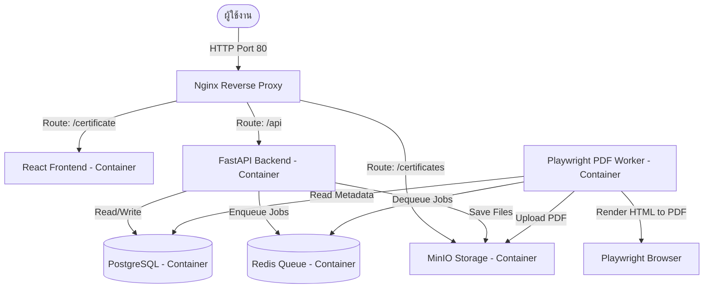

# ระบบออกใบรับรองอิเล็กทรอนิกส์ (E-Certificate Platform)

ระบบออกและตรวจสอบใบรับรองอิเล็กทรอนิกส์แบบครบวงจร (E-Certificate Platform) ที่สร้างขึ้นมาตามหลักสถาปัตยกรรม Microservices ทำงานด้วย Docker Compose ประกอบไปด้วยบริการต่างๆ เช่น เว็บแอปพลิเคชัน (React/Vite), บริการ API (FastAPI), ตัวแปลงไฟล์ PDF (Playwright Worker), ฐานข้อมูล (PostgreSQL), บริการคิวงาน (Redis) และระบบจัดเก็บข้อมูลออบเจกต์ (MinIO)

---

## 🏗️ สถาปัตยกรรมระบบ (System Architecture)



---

## 📂 โครงสร้างโฟลเดอร์ของโปรเจกต์ (Directory Structure)

```text
Certificate-Platform/
├── apps/
│   ├── api/                 # FastAPI Backend Code & Dockerfile
│   └── web/                 # React (Vite) Frontend Code & Dockerfile
├── workers/
│   └── pdf-worker/          # Playwright PDF Generation Worker & Dockerfile
├── nginx/
│   └── default.conf         # Nginx configuration (Reverse Proxy / Routing)
├── scripts/                 # สคริปต์สำหรับการดูแลระบบและการทดสอบระบบ (Integration Tests)
│   ├── backup.sh            # สคริปต์สแกนและสำรองข้อมูลฐานข้อมูล/ออบเจกต์
│   ├── inspect_and_clean_users.py
│   ├── verify_flow.py       # การทดสอบการทำงานระบบตั้งแต่ต้นจนจบ (E2E Integration Test)
│   ├── verify_oauth_whitelist.py
│   ├── verify_user_mgmt.py
│   ├── verify_whitelist_adv.py
│   └── verify_whitelist_selection_import.py
├── .env.example             # เทมเพลตตัวแปรสภาพแวดล้อม (Environment Variables Template)
├── .gitignore               # การตั้งค่าละเว้นไฟล์ของ Git
├── docker-compose.yml       # ไฟล์ควบคุมการคอมไพล์และเปิดระบบผ่าน Docker Compose
└── README.md                # คู่มือการใช้งานระบบ
```

---

## 🚀 ขั้นตอนการติดตั้งและการเปิดใช้งานระบบ (Installation & Run Guide)

โปรเจกต์นี้สามารถนำไปติดตั้งบนระบบปฏิบัติการ Ubuntu หรือ OS อื่นๆ ที่รองรับ Docker และ Docker Compose ได้ทันที โดยตั้งค่าตามขั้นตอนดังนี้:

### 1. คัดลอกและสร้างไฟล์สภาพแวดล้อม (.env)
คัดลอกตัวอย่างเทมเพลตเพื่อสร้างไฟล์คอนฟิกสภาพแวดล้อมหลักของระบบ:
```bash
cp .env.example .env
```
เปิดไฟล์ `.env` เพื่อแก้ไขการตั้งค่าที่จำเป็น (เช่น `DOMAIN`, `SECRET_KEY`, `POSTGRES_PASSWORD` ฯลฯ) ให้เหมาะสมกับสิ่งแวดล้อมการทำงานของท่าน

### 2. คอมไพล์และเปิดใช้งานคอนเทนเนอร์ด้วย Docker Compose
สั่งรัน Docker Compose เพื่อดาวน์โหลดอิมเมจ คอมไพล์ซอร์สโค้ด และรันเซอร์วิสทั้งหมดในเบื้องหลัง (Background Mode):
```bash
docker-compose up --build -d
```

### 3. เตรียมฐานข้อมูลเริ่มต้น (Seed Database)
เมื่อเซอร์วิสทั้งหมดเปิดทำงานเรียบร้อยแล้ว ให้ทำการรันสคริปต์จำลองบัญชีผู้ใช้งานระบบเริ่มต้น (admin, staff, student) และเทมเพลตมาตรฐาน:
```bash
docker exec -it ecert_api python seed.py
```
**บัญชีผู้ใช้เริ่มต้นที่ระบบจัดตั้งขึ้น:**
- **ผู้ดูแลระบบสูงสุด (Super Admin):** `admin@example.com` / รหัสผ่าน: `admin123`
- **เจ้าหน้าที่การศึกษา (Staff):** `staff@example.com` / รหัสผ่าน: `staff123`
- **ผู้รับใบรับรอง/นักศึกษา (Verifier):** `verifier@example.com` / รหัสผ่าน: `verifier123`

---

## ⚙️ การตั้งค่า Google OAuth และ Whitelist
ระบบรองรับการเข้าสู่ระบบแบบ Single Sign-On (SSO) ด้วย Google OAuth โดยการทำงานจะถูกเก็บข้อมูลคีย์และเปิด/ปิดระบบอยู่ในตารางฐานข้อมูล `system_setting` ซึ่งผู้ดูแลระบบสามารถกำหนดค่าได้โดยตรงผ่านแผงการตั้งค่าในหน้าเว็บ จัดเก็บคีย์ดังนี้:
1. `google_oauth_enabled`: เปิดใช้งาน Google Login (`true`/`false`)
2. `google_client_id`: รหัส Client ID ที่ได้จาก Google Cloud Console
3. `google_client_secret`: รหัส Client Secret ที่ได้จาก Google Cloud Console

*สตาฟฟ์และแอดมินจะต้องมีอีเมลอยู่ในระบบ **Whitelist User** ก่อน จึงจะสามารถล็อกอินผ่าน Google เข้าสู่แผงจัดการได้*

---

## 🧪 การทดสอบระบบ (Integration Testing)
เราได้เตรียมสคริปต์ควบคุมและตรวจสอบการไหลของข้อมูลในระบบตั้งแต่ต้นจนจบ (E2E Flow) เช่น ล็อกอิน สร้างกลุ่มใบรับรอง อัปโหลดรายชื่อ แปลงไฟล์เป็น PDF และการทำแบบทดสอบความถูกต้องของแฮชไฟล์เอกสาร

สามารถสั่งรันเทสจากภายนอกคอนเทนเนอร์ได้โดยตั้งค่าตัวแปร `BASE_URL` หรือรันผ่าน python:
```bash
# กำหนด URL ของระบบที่จะใช้รันเทส (หากไม่ใช่ localhost)
export BASE_URL="http://localhost"

# ติดตั้งไลบรารีที่จำเป็นสำหรับเครื่องทดสอบ
pip install requests

# รัน Integration Test หลัก
python scripts/verify_flow.py
```

---

## 💾 ระบบสำรองข้อมูล (Backup System)
ระบบมีสคริปต์ `scripts/backup.sh` สำหรับสร้างไฟล์แบ็กอัปฐานข้อมูล SQL และไฟล์ออบเจกต์ PDF ใน MinIO โดยเก็บประวัติย้อนหลังไว้ตามเวลา สามารถคัดลอกไปรันเป็น Daily Cron Job บนเครื่องเซิร์ฟเวอร์หลัก (เช่น Ubuntu) ได้

```bash
# ตัวอย่างคำสั่งรันระบบแบ็กอัปข้อมูลด้วยตนเอง
chmod +x scripts/backup.sh
./scripts/backup.sh
```
*โดยปกติจะสำรองข้อมูล PostgreSQL และ MinIO Tarball ไว้ที่ `/home/ubuntu/backups` และลบไฟล์แบ็กอัปที่มีอายุเกินกว่า 7 วันโดยอัตโนมัติ*